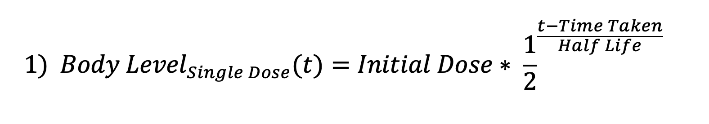
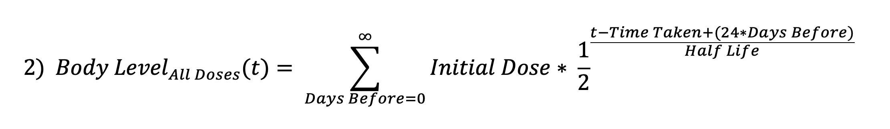
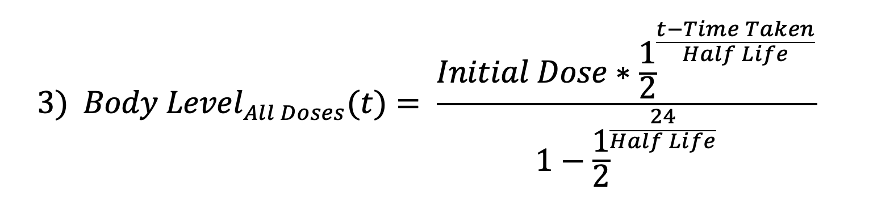
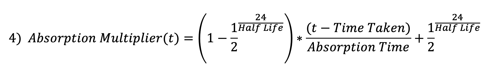
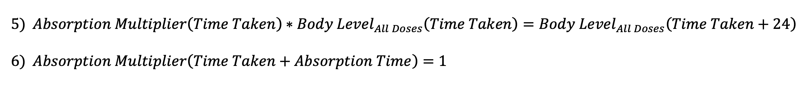
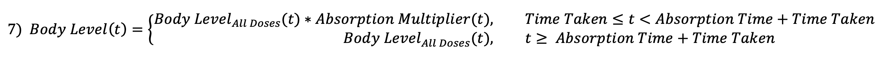

<h1>Medication Level Over a 24 Hour Period</h1>
<b>Made by Sam Slate</b> 
<i>Note: this is an approximate model of complex drug interactions. For better information, contact a medical professional or dive into the world of <a href="https://en.wikipedia.org/wiki/Pharmacokinetics">pharmocokinetics</a> for yourself!</i>  

<form>
  <input type="checkbox" id="show_initial_doses" checked onclick="draw_graph_click()"> Show Initial Doses
  <input type="checkbox" id="show_level_before" checked onclick="draw_graph_click()"> Show Levels Before Doses
  <input type="checkbox" id="show_level_after" checked onclick="draw_graph_click()"> Show Levels After Full Absorption 
  <input type="checkbox" id="show_overall_max" unchecked onclick="draw_graph_click()"> Show Overall Maximum Level
  <input type="checkbox" id="show_overall_min" unchecked onclick="draw_graph_click()"> Show Overall Minimum Level
</form>
 
<h2>Enter the values in the field and click "Draw Graph":</h2>

<form id="frm1" action="/action_page.php">

  <input type="button" onclick="draw_graph_click()" value="Draw Graph">  
  
  Half Life of Medication: <input id="half_life" type="number" value="16"> 
  Absorption Time: <input id="absorption_time" type="number" value="1">  
 
  <b>Dose 1:</b>  
  Initial Dose: <input id="initial_dose_1" type="number" value="60"> 
  Time Taken (military time): <input id="time_taken_1" type="number" value="4">  
  
  <b>Dose 2:</b>  
  Initial Dose: <input id="initial_dose_2" type="number" value="0"> 
  Time Taken (military time): <input id="time_taken_2" type="number" value="0">  
  
  <b>Dose 3:</b>  
  Initial Dose: <input id="initial_dose_3" type="number" value="0"> 
  Time Taken (military time): <input id="time_taken_3" type="number" value="0">  
  
  <b>Dose 4:</b>  
  Initial Dose: <input id="initial_dose_4" type="number" value="0"> 
  Time Taken (military time): <input id="time_taken_4" type="number" value="0">  
  
  <b>Dose 5:</b>  
  Initial Dose: <input id="initial_dose_5" type="number" value="0"> 
  Time Taken (military time): <input id="time_taken_5" type="number" value="0">
  
  
</form> 

  
<h1>Equations</h1>
<h3>Basic half-life equation:</h3>

This equation is a more intuitive (for me) form of the standard <a href="https://en.wikipedia.org/wiki/Exponential_decay">exponential decay formula</a>  
<h3>Summation equation to account for previous doses:</h3>

Assuming that all previous doses were of the same amount and taken at the same time  
<h3>Reduced form of above summation equation:</h3>
  
<h3>Linear multiplier to account for initial absorption time:</h3>
  
<h3>This linear equation satisfies the following two conditions:</h3>

- The first condition ensures that the level at Time Taken is equal to the level at 24 hours after Time Taken 
- The second condition ensures that the absorption multiplier is no longer in effect by the time of Time Taken + Absorption Time  
<h3>The final piece-wise function used in the model:</h3>

